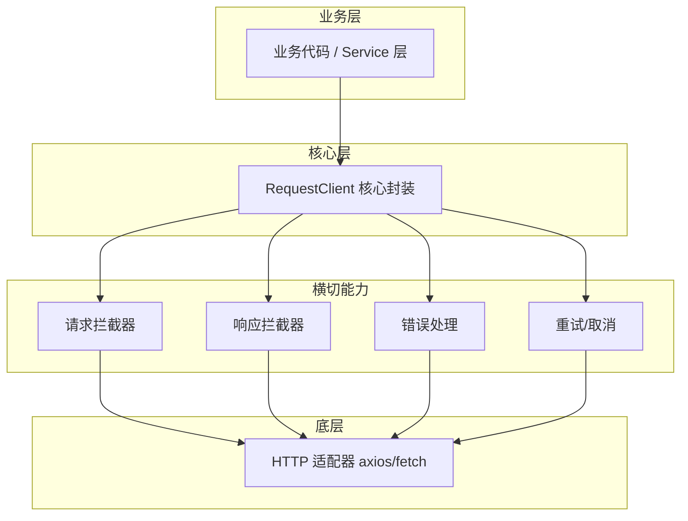

# 请求封装最佳实践

**开发文档 · 面向前端工程团队的设计与实现指南**

版本 1.0 · 2026-07-24

---

## 背景与目标

在大型前端应用中，网络请求往往散落在业务代码各处。若每个模块都直接调用底层 HTTP 客户端，会导致统一鉴权、错误处理、日志、重试等横切关注点难以维护。请求封装层的价值在于把“如何发请求”收敛到一处，让业务代码只关心“请求什么”。

一套合格的请求封装应满足以下目标：

- **统一入口：** 业务代码不直接依赖 axios、fetch 等具体库。
- **类型安全：** 请求参数、响应体、错误结构都有 TypeScript 类型约束。
- **可扩展：** 鉴权、日志、Mock、限流可通过插件或拦截器注入。
- **可观测：** 请求生命周期可被追踪，错误可被集中上报。
- **可测试：** 网络层可被 Mock，业务代码无需改动即可跑单元测试。

---

## 整体架构

推荐采用“适配器 + 核心客户端 + 拦截器链 + 插件”的四层结构。底层适配器负责与具体 HTTP 库交互，核心客户端负责调度，拦截器链处理横切逻辑，插件提供可插拔扩展。



### 模块职责

| 模块                 | 职责                                     | 是否暴露给业务 |
| -------------------- | ---------------------------------------- | -------------- |
| `HttpAdapter`        | 封装 axios/fetch 的具体调用，屏蔽库差异  | 否             |
| `RequestClient`      | 提供 `request`、`get`、`post` 等统一 API | 是             |
| `InterceptorManager` | 管理请求/响应拦截器的注册、执行与顺序    | 否             |
| `ErrorHandler`       | 统一解析 HTTP、业务、网络异常            | 部分           |
| `PluginSystem`       | 支持日志、Mock、限流等插件               | 扩展时         |
| `Service 层`         | 按业务领域聚合接口，调用 RequestClient   | 是             |

---

## 目录结构

建议把请求封装作为独立模块放在 `src/request` 或 `src/shared/request` 下，避免与业务代码耦合。

| 文件                                | 说明                                             |
| ----------------------------------- | ------------------------------------------------ |
| `request/types.ts`                  | 类型定义（Config、Response、Error、Interceptor） |
| `request/adapter/`                  | HTTP 适配器目录与统一导出                        |
| `request/adapter/fetch.adapter.ts`  | Fetch 适配器实现                                 |
| `request/adapter/axios.adapter.ts`  | Axios 适配器实现                                 |
| `request/adapter/uniapp.adapter.ts` | UniApp 适配器实现                                |
| `request/client.ts`                 | RequestClient 核心类                             |
| `request/interceptor.ts`            | 拦截器管理器                                     |
| `request/error.ts`                  | 错误类与错误码映射                               |
| `request/retry.ts`                  | 重试策略                                         |
| `request/plugins/`                  | 日志、Mock 等插件                                |
| `request/index.ts`                  | 对外导出默认 client 与工厂函数                   |
| `services/`                         | 按业务领域封装的 API 服务层                      |

---

## 核心设计

### 类型定义

先把契约定义清楚，再写实现。配置、响应、错误都应具备泛型支持，让业务层调用时获得完整类型推断。

```typescript
export interface RequestConfig<TParams = unknown, TData = unknown> {
  url: string;
  // 覆盖客户端全局 baseURL；空字符串表示本次请求不使用全局基地址
  baseURL?: string;
  method?: "GET" | "POST" | "PUT" | "DELETE" | "PATCH";
  params?: TParams;
  data?: TData;
  headers?: Record<string, string>;
  timeout?: number;
  retry?: number | RetryPolicy;
  withCredentials?: boolean;
  signal?: AbortSignal;
  // 业务扩展字段，插件可读取
  meta?: Record<string, unknown>;
}

export interface HttpResponse<T = unknown> {
  data: T;
  status: number;
  statusText: string;
  headers: Record<string, string>;
  config: RequestConfig;
}

export interface BusinessError {
  code: string;
  message: string;
  details?: unknown;
}

export type RequestError = NetworkError | TimeoutError | HttpError | BusinessError;

export interface Interceptor<T = unknown, R = unknown> {
  fulfilled?: (value: T) => T | Promise<T>;
  rejected?: (error: R, value: T | undefined) => T | Promise<T>;
}
```

### 适配器抽象

通过适配器接口屏蔽 axios 与 fetch 的差异，未来替换底层库时不会影响业务代码。

```typescript
export interface HttpAdapter {
  request<T>(config: RequestConfig): Promise<HttpResponse<T>>;
  abort?(requestId: string): void;
}

// axios 实现示例
export class AxiosAdapter implements HttpAdapter {
  constructor(private instance: AxiosInstanceLike) {}

  async request<T>(config: RequestConfig): Promise<HttpResponse<T>> {
    const res = await this.instance.request<T>({
      url: config.url,
      method: config.method,
      params: config.params,
      data: config.data,
      headers: config.headers,
      timeout: config.timeout,
      signal: config.signal,
      withCredentials: config.withCredentials,
    });
    return {
      data: res.data,
      status: res.status,
      statusText: res.statusText,
      headers: res.headers as Record<string, string>,
      config,
    };
  }
}
```

### RequestClient 实现

核心客户端负责把请求配置依次经过请求拦截器、适配器、响应拦截器、错误处理，并支持取消与重试。

```typescript
export class RequestClient {
  private requestInterceptors = new InterceptorManager<RequestConfig>();
  private responseInterceptors = new InterceptorManager<HttpResponse<unknown>>();

  constructor(
    private adapter: HttpAdapter,
    private options: ClientOptions = {},
  ) {}

  useRequestInterceptor(interceptor: Interceptor<RequestConfig>) {
    this.requestInterceptors.use(interceptor);
    return () => this.requestInterceptors.eject(interceptor);
  }

  useResponseInterceptor(interceptor: Interceptor<HttpResponse<unknown>>) {
    this.responseInterceptors.use(interceptor);
    return () => this.responseInterceptors.eject(interceptor);
  }

  async request<T>(config: RequestConfig): Promise<T> {
    const initialConfig = {
      ...config,
      meta: this.options.meta || config.meta ? { ...this.options.meta, ...config.meta } : undefined,
    };
    const finalConfig = await this.requestInterceptors.run(initialConfig);
    const res = await this.adapter.request<T>(finalConfig);
    const finalRes = await this.responseInterceptors.run(res);
    return finalRes.data;
  }

  get<T, P = unknown>(
    url: string,
    params?: P,
    config?: Omit<RequestConfig, "url" | "method" | "params">,
  ) {
    return this.request<T>({ ...config, url, method: "GET", params });
  }

  post<T, D = unknown>(
    url: string,
    data?: D,
    config?: Omit<RequestConfig, "url" | "method" | "data">,
  ) {
    return this.request<T>({ ...config, url, method: "POST", data });
  }
}
```

> **注意**：客户端全局 `meta` 与单次请求 `meta` 使用浅合并，同名键由单次请求覆盖。上面的
> `request` 省略了其他默认配置、重试、取消、错误转换等逻辑，完整实现见下文。

---

## 拦截器链

拦截器是请求封装最重要的扩展点。建议把拦截器设计为可注册、可卸载、按注册顺序执行的链式结构。

```typescript
export class InterceptorManager<T> {
  private interceptors: Interceptor<T>[] = [];

  use(interceptor: Interceptor<T>) {
    this.interceptors.push(interceptor);
  }

  eject(interceptor: Interceptor<T>) {
    const idx = this.interceptors.indexOf(interceptor);
    if (idx > -1) this.interceptors.splice(idx, 1);
  }

  async run(value: T): Promise<T> {
    let result = value;
    for (const interceptor of this.interceptors) {
      try {
        result = (await interceptor.fulfilled?.(result)) ?? result;
      } catch (err) {
        if (interceptor.rejected) {
          result = await interceptor.rejected(err, result);
        } else {
          throw err;
        }
      }
    }
    return result;
  }
}
```

### 常用拦截器示例

#### 鉴权拦截器

```typescript
client.useRequestInterceptor({
  async fulfilled(config) {
    const token = await getAccessToken();
    if (token) {
      config.headers = {
        ...config.headers,
        Authorization: `Bearer ${token}`,
      };
    }
    return config;
  },
});

client.useResponseInterceptor({
  async rejected(error) {
    if (error.status === 401) {
      await refreshToken();
      // 重新触发原请求需额外实现 retry token
    }
    throw error;
  },
});
```

#### 日志拦截器

```typescript
client.useRequestInterceptor({
  fulfilled(config) {
    if (process.env.NODE_ENV === "development") {
      console.log(`[Request] ${config.method} ${config.url}`, config);
    }
    return config;
  },
});

client.useResponseInterceptor({
  fulfilled(res) {
    if (process.env.NODE_ENV === "development") {
      console.log(`[Response] ${res.status} ${res.config.url}`, res.data);
    }
    return res;
  },
});
```

---

## 错误处理

错误处理应区分三类异常：网络异常、HTTP 状态异常、业务逻辑异常。统一转换后抛出，业务层只需处理一种错误格式。

### 错误分类

| 异常类型        | 触发条件                    | 典型处理                 |
| --------------- | --------------------------- | ------------------------ |
| `NetworkError`  | 无网络、DNS 失败、CORS 阻断 | 提示用户检查网络，可重试 |
| `TimeoutError`  | 请求超过 timeout            | 提示超时，可重试         |
| `HttpError`     | HTTP status ≥ 400           | 根据状态码做通用处理     |
| `BusinessError` | status 200 但业务 code ≠ 0  | 按业务 code 处理         |

### 错误类定义

```typescript
export class HttpError extends Error {
  constructor(
    message: string,
    public status: number,
    public response?: HttpResponse<unknown>,
  ) {
    super(message);
    this.name = "HttpError";
  }
}

export class BusinessError extends Error {
  constructor(
    message: string,
    public code: string,
    public details?: unknown,
  ) {
    super(message);
    this.name = "BusinessError";
  }
}

export class TimeoutError extends Error {
  constructor(message = "Request timeout") {
    super(message);
    this.name = "TimeoutError";
  }
}
```

### 响应拦截器中的错误转换

```typescript
client.useResponseInterceptor({
  fulfilled(res) {
    // 示例：后端统一返回 { code, data, message }
    if (res.data && typeof res.data === "object") {
      const payload = res.data as { code?: number; data?: unknown; message?: string };
      if (payload.code !== undefined && payload.code !== 0) {
        throw new BusinessError(
          payload.message || "Business error",
          String(payload.code),
          payload.data,
        );
      }
      return { ...res, data: payload.data };
    }
    return res;
  },
  rejected(error) {
    if (error.name === "AbortError") throw error;
    if (error.code === "ECONNABORTED" || error.message?.includes("timeout")) {
      throw new TimeoutError();
    }
    if (error.response) {
      throw new HttpError(error.message, error.response.status, error.response);
    }
    throw new NetworkError(error.message);
  },
});
```

---

## 重试与取消

### 重试策略

重试不应无条件进行。只对网络错误、超时、特定幂等请求启用，并设置指数退避，避免对服务端造成冲击。

```typescript
export interface RetryPolicy {
  maxRetries: number;
  delay?: number;
  backoff?: "fixed" | "exponential";
  retryable?: (error: RequestError) => boolean;
}

const defaultRetryable = (error: RequestError): boolean =>
  error instanceof NetworkError || error instanceof TimeoutError;

export async function executeWithRetry<T>(
  fn: () => Promise<T>,
  policy?: number | RetryPolicy,
): Promise<T> {
  if (policy === undefined) return fn();

  const config: RetryPolicy =
    typeof policy === "number"
      ? { maxRetries: policy, retryable: defaultRetryable }
      : { retryable: defaultRetryable, ...policy };

  let lastError: unknown;
  for (let attempt = 0; attempt <= config.maxRetries; attempt++) {
    try {
      return await fn();
    } catch (err) {
      lastError = err;
      if (attempt === config.maxRetries || !config.retryable?.(err as RequestError)) {
        throw err;
      }
      const baseDelay = config.delay ?? 1000;
      const wait = config.backoff === "exponential" ? baseDelay * Math.pow(2, attempt) : baseDelay;
      await new Promise((resolve) => setTimeout(resolve, wait));
    }
  }
  throw lastError;
}
```

### 请求取消

使用 `AbortController` 统一处理请求取消，确保组件卸载、路由切换时不会触发已销毁组件的状态更新。

```typescript
export function createRequest(client: RequestClient) {
  const controller = new AbortController();

  const execute = <T>(config: RequestConfig) =>
    client.request<T>({ ...config, signal: controller.signal });

  return { execute, abort: () => controller.abort() };
}

// React 组件中使用
useEffect(() => {
  const { execute, abort } = createRequest(httpClient);
  execute<User>({ url: "/api/user" }).then(setUser);
  return abort;
}, []);
```

---

## 插件系统

对于日志、Mock、限流、签名等能力，建议以插件形式提供，避免核心类膨胀。

```typescript
export interface RequestPlugin {
  name: string;
  setup: (client: RequestClient) => void | (() => void);
}
```

---

## Service 层组织

不要让业务组件直接调用 `client.get('/api/...')`，而是按领域封装 Service，让 URL 和类型在 Service 中集中管理。

```typescript
// services/user.ts
import { httpClient } from "@/request";

export interface User {
  id: string;
  name: string;
  email: string;
}

export const userService = {
  getProfile(id: string) {
    return httpClient.get<User>(`/api/users/${id}`);
  },

  updateProfile(id: string, data: Partial<User>) {
    return httpClient.put<User>(`/api/users/${id}`, data);
  },
};

// 组件中
const user = await userService.getProfile(userId);
```

---

## 默认实例与工厂函数

提供一个开箱即用的 Fetch 默认实例，同时允许通过 adapter 创建 Axios、UniApp 等多实例。

```typescript
import axios from "axios";
import { AxiosAdapter, createHttpClient } from "@/request";

export const httpClient = createHttpClient({
  baseURL: import.meta.env.VITE_API_BASE_URL,
  timeout: 10000,
  retry: { maxRetries: 2, delay: 500 },
});

export const axiosClient = createHttpClient({
  adapter: new AxiosAdapter(axios.create()),
});
```

---

## 测试策略

- **单元测试：** Mock `HttpAdapter`，验证拦截器链、重试、错误转换逻辑。
- **集成测试：** 使用 MSW 拦截真实请求，验证 Service 层与请求封装协同工作。
- **契约测试：** 与后端对齐接口契约，确保 TypeScript 类型与后端接口一致。

```typescript
it("should retry on timeout", async () => {
  const adapter: HttpAdapter = {
    request: vi
      .fn()
      .mockRejectedValueOnce(new TimeoutError())
      .mockResolvedValueOnce({ data: { ok: true }, status: 200 }),
  };
  const client = new RequestClient(adapter);
  const result = await client.request({ url: "/test", retry: 2 });
  expect(result).toEqual({ ok: true });
  expect(adapter.request).toHaveBeenCalledTimes(2);
});
```

---

## 实现 checklist

- 业务代码不直接依赖 axios/fetch，统一通过 `RequestClient` 发请求。
- 所有请求参数、响应、错误均具备 TypeScript 类型。
- 请求/响应拦截器支持注册与卸载，顺序可控。
- 错误统一转换，区分网络、超时、HTTP、业务四类异常。
- 重试策略可配置，仅对幂等或可恢复错误启用。
- 使用 `AbortController` 管理请求生命周期，避免内存泄漏。
- 按业务领域封装 Service 层，避免 URL 散落在组件中。
- 插件化扩展日志、Mock 等能力。

---

请求封装最佳实践 · 开发文档。如有问题，请在团队内讨论并持续迭代。
