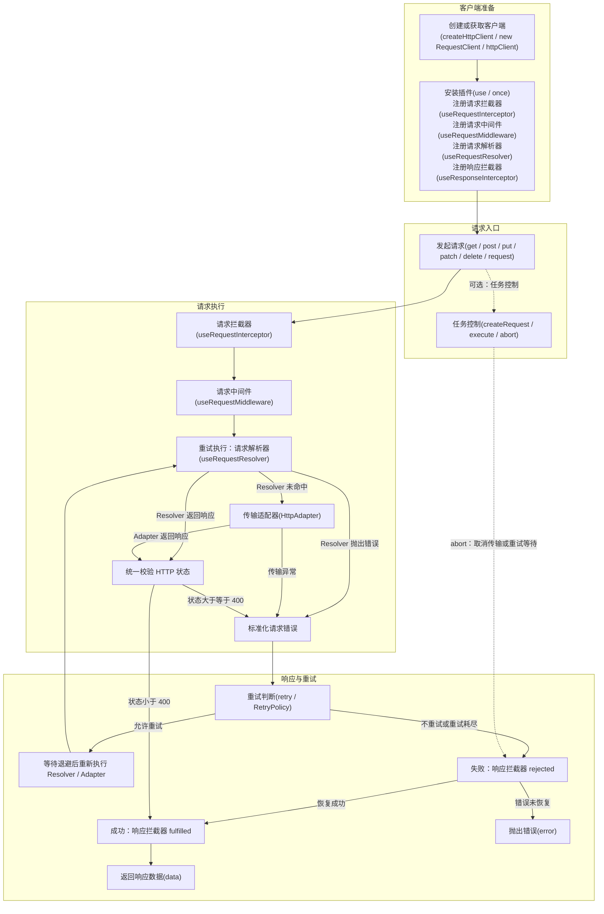

# 请求公共 API 生命周期与使用场景

本文只说明调用方可直接使用的公共 API，以及它们在一次请求中的运行时机和使用场景。
不展示请求库的私有方法、内部调度函数或 Adapter 的内部实现。

## 1. 公共 API 生命周期



各阶段的关系如下：

1. 使用 `createHttpClient()`、`new RequestClient()` 或 `httpClient` 获得客户端。
2. 在请求发起前，通过 `use()` 安装插件，或注册请求、Middleware、Resolver 和响应扩展点。
3. 调用 `get`、`post`、`put`、`patch`、`delete` 或 `request` 发起请求。
4. 可选的 `createRequest().execute()` 同样进入该请求链；调用 `abort()` 会取消进行中的请求或重试等待。
5. 请求拦截器先处理最终请求配置。
6. Middleware 包裹后续请求执行过程；Resolver 可以在传输前直接返回响应。
7. 未被 Resolver 处理的请求由选定的 Adapter 发送；失败时根据 `retry` 与 `RetryPolicy` 判断是否再次尝试。
8. 响应拦截器处理最终响应或最终错误。
9. 成功时调用方得到 `response.data`；未恢复的错误由调用方 `catch` 接收。

## 2. 客户端与插件 API

### `createHttpClient(options?)`

**运行时机：** 应用初始化、模块初始化或创建独立请求实例时调用；不会随每次请求重复执行。

**使用场景：**

- 配置共享的 `baseURL`、timeout、headers、retry 和 meta。
- 选择 `FetchAdapter`、`AxiosAdapter`、`UniAppAdapter` 或自定义 Adapter。
- 使用或关闭默认的业务响应解包。

```ts
import { createHttpClient } from "@chan9808/retry-request";

const client = createHttpClient({
  baseURL: "https://api.example.com",
  timeout: 10_000,
  retry: 2,
});
```

默认客户端使用 `FetchAdapter`、10 秒超时，并启用 `{ code, data, message }` 响应解包。传入
`responseEnvelope: false` 可关闭默认解包。

### `new RequestClient(adapter, options?)`

**运行时机：** 需要显式构造客户端时调用；不会随每次请求重复执行。

**使用场景：**

- 完全控制 Adapter 和默认配置。
- 不安装默认业务响应解包。
- 为测试或底层集成创建隔离客户端。

### `httpClient`

**运行时机：** 请求库模块首次加载时创建，之后持续复用。

**使用场景：** 无需自定义客户端配置时，直接使用默认共享客户端。

### `client.use(plugin)`

**运行时机：** 调用时立即执行 `plugin.setup(client)`。插件在 setup 中注册的公共扩展点，会在
之后发起的请求中运行。

**使用场景：**

- 安装请求去重、Mock、日志等可复用能力。
- 将多个扩展点注册与清理封装为一个插件。

```ts
import { createDedupePlugin } from "@chan9808/retry-request";

const removeDedupe = client.use(createDedupePlugin({ windowMs: 2_000 }));

// 卸载插件及其注册的扩展点。
removeDedupe();
```

对同一个插件对象重复调用 `use()` 不会重复安装。返回的清理函数执行后，该插件对象可以再次安装。

## 3. 请求入口 API

### `get`、`post`、`put`、`patch`、`delete`

**运行时机：** 业务代码发起请求时调用。快捷方法会构造对应 HTTP 方法的配置，并进入同一套请求
生命周期。

**使用场景：** 使用符合 HTTP 语义的简洁方式发起常规请求。

```ts
const user = await client.get<User>("/users/1");
const created = await client.post<User, CreateUser>("/users", form);
```

`POST` 和 `PATCH` 等非幂等方法默认不会重试；只有配置 `retryNonIdempotent: true` 时才会参与重试。

### `request(config)`

**运行时机：** 快捷方法会调用它；业务代码也可以直接调用。它是所有请求进入扩展点生命周期的
统一公开入口。

**使用场景：**

- 动态决定 HTTP 方法。
- 需要完整 `RequestConfig`。
- 封装 Service 层请求函数。

```ts
const result = await client.request<User>({
  url: "/users/1",
  method: "GET",
  headers: { "x-source": "profile" },
});
```

成功时返回经过响应拦截器处理后的 `response.data`，而不是完整 `HttpResponse`。

### `createRequest(client)`、`execute()`、`abort()`

**运行时机：** `createRequest()` 创建一个共享取消控制器；每次 `execute()` 都会进入正常请求
生命周期；调用 `abort()` 时立即取消该控制器尚未完成的请求及其重试等待。

**使用场景：**

- 组件卸载或路由离开时取消相关请求。
- 管理一个业务操作中的多次请求。

```ts
import { createRequest } from "@chan9808/retry-request";

const pending = createRequest(client);
const promise = pending.execute<User>({ url: "/profile" });

pending.abort();
await promise;
```

调用 `abort()` 后，该控制器不可复用；需要再次发起可取消请求时，应重新调用 `createRequest()`。

## 4. 请求扩展 API

所有注册 API 都应在目标请求发起前调用，并返回幂等的卸载函数。卸载会影响后续请求，但不会中断
已经开始的请求。

### `useRequestInterceptor(interceptor)`

**运行时机：** 每次请求完成客户端配置与单次配置合并后运行，早于 Middleware、Resolver、Adapter
和响应拦截器。多个请求拦截器按注册顺序形成 Promise 链。

**输入和输出：** `fulfilled` 接收 `RequestConfig` 并返回新的 `RequestConfig`；`rejected` 可以恢复
前面请求拦截器产生的错误。

**使用场景：**

- 添加 Token、签名、Trace ID 和动态 header。
- 异步读取登录凭证。
- 修改 params、timeout、retry 或 meta。
- 在发出请求前校验请求配置。

```ts
const removeAuth = client.useRequestInterceptor({
  async fulfilled(config) {
    const token = await getToken();
    return {
      ...config,
      headers: {
        ...config.headers,
        Authorization: `Bearer ${token}`,
      },
    };
  },
});
```

请求拦截器不能处理 Adapter、重试或响应阶段的错误；这些阶段尚未开始。

### `useRequestMiddleware(middleware)`

**运行时机：** 请求拦截器完成后运行，包裹后续的请求执行、重试、Resolver 和 Adapter。每个业务
请求只进入 Middleware 链一次；即使底层发生重试，也不会重新执行整条 Middleware 链。

**输入和输出：** 接收最终 `RequestConfig` 与 `next()`。调用 `next()` 会继续后续请求过程；直接
返回 `Promise<HttpResponse>` 可以短路后续过程。

**使用场景：**

- 请求缓存与相同请求合并。
- 限流、并发控制和熔断。
- 统计包含全部重试在内的总耗时。
- 在 `await next()` 前后观察或转换底层响应。

```ts
const removeTiming = client.useRequestMiddleware(async (config, next) => {
  const startedAt = Date.now();
  try {
    return await next();
  } finally {
    console.debug(config.url, Date.now() - startedAt);
  }
});
```

多个 Middleware 按注册顺序从外到内执行：

```text
middleware A before
  middleware B before
    resolver / adapter / retry
  middleware B after
middleware A after
```

Middleware 早于响应拦截器，因此它看不到后续响应拦截器抛出的业务错误。

### `useRequestResolver(resolver)`

**运行时机：** 位于 Middleware 的内部、Adapter 之前。每次重试尝试都会再次运行 Resolver。Resolver
按注册顺序执行，第一个返回 `HttpResponse` 的 Resolver 会跳过剩余 Resolver 和 Adapter。

**输入和输出：** 接收最终 `RequestConfig`；返回 `HttpResponse` 表示已处理请求，返回 `undefined`
表示继续后续 Resolver 或 Adapter。

**使用场景：**

- Mock 路由命中后返回模拟响应。
- 从离线数据或本地缓存中返回标准响应。
- 在无需网络请求时短路实际传输。

```ts
const removeResolver = client.useRequestResolver(async (config) => {
  if (config.url !== "/health") return undefined;
  return {
    data: { ok: true },
    status: 200,
    statusText: "OK",
    headers: {},
    config,
  };
});
```

没有命中时必须返回 `undefined`，否则会阻断真实 Adapter 请求。

### `useResponseInterceptor(interceptor)`

**运行时机：** 请求执行、重试和传输结束后运行。多个响应拦截器按注册顺序形成 Promise 链；成功
响应进入 `fulfilled`，最终失败进入可处理该错误的 `rejected`。

**输入和输出：** `fulfilled` 接收并返回 `HttpResponse`；`rejected(error, latestResponse)` 可以返回
`HttpResponse`，将失败链恢复为成功链。

**使用场景：**

- 业务响应解包和业务 code 判断。
- 统一业务错误转换。
- 响应日志、错误日志与监控上报。
- 使用备用响应恢复可预期错误。

```ts
const removeReporter = client.useResponseInterceptor({
  fulfilled(response) {
    reportSuccess(response.config.url);
    return response;
  },
  rejected(error, latestResponse) {
    reportError(error, latestResponse);
    throw error;
  },
});
```

即使请求去重让多个调用复用同一个底层请求，每个调用也会独立运行响应拦截器。

## 5. 重试、响应、Adapter 与错误公共 API

### `retry` 与 `RetryPolicy`

**运行时机：**

- 在 `createHttpClient({ retry })` 或 `new RequestClient(adapter, { retry })` 中配置时，作为客户端默认重试策略保存。
- 在 `get`、`post` 等快捷方法的 config，或 `request({ retry })` 中配置时，作为本次请求的重试策略。
- 每次传输尝试失败后，才根据该策略决定是否再次尝试；成功请求不会触发重试判断。

**使用场景：**

- 为网络抖动、超时、HTTP 408、429 和 5xx 配置自动重试。
- 通过固定或指数退避减少高频失败请求。
- 对指定接口覆盖全局重试次数，或以 `retry: 0` 关闭本次重试。
- 通过 `retryable` 为特定错误制定是否重试的规则。

```ts
const client = createHttpClient({
  retry: {
    max: 3,
    delay: 500,
    backoff: "exponential",
    retryable(error, context) {
      return error.name !== "BusinessError" && context.method !== "POST";
    },
  },
});

await client.get("/users", undefined, {
  // 本次请求整体覆盖客户端默认 retry；0 表示禁用重试。
  retry: 0,
});
```

`retryable(error, context)` 只在失败后、尚未达到 `max` 时运行。`context` 提供当前失败次数和
HTTP 方法。默认只会重试网络错误、超时错误、HTTP 408、429 和 5xx；`POST`、`PATCH` 等非幂等
方法必须显式设置 `retryNonIdempotent: true` 才会参与重试。

> `retry` 处于请求执行阶段，早于 `useResponseInterceptor`。因此响应拦截器中抛出的
> `BusinessError` 不会触发当前请求的重试。

### `createResponseEnvelopeInterceptor(options?)`

**运行时机：** 调用创建函数时得到可注册的响应拦截器；请求完成后，该拦截器在响应阶段运行。
`createHttpClient()` 默认已注册它；只有关闭 `responseEnvelope` 或直接构造 `RequestClient` 时，才
需要手动注册。

**使用场景：**

- 解包 `{ code, data, message }` 或字段名不同的业务响应。
- 将非成功业务 code 转换为 `BusinessError`。

```ts
import { createResponseEnvelopeInterceptor } from "@chan9808/retry-request";

client.useResponseInterceptor(
  createResponseEnvelopeInterceptor({
    successCode: 200,
    dataKey: "result",
  }),
);
```

### `HttpAdapter`、`FetchAdapter`、`AxiosAdapter`、`UniAppAdapter`

**运行时机：** 创建客户端时通过 `adapter` 选择；每次 Resolver 未返回响应时，选定 Adapter 执行
一次传输。发生重试时，Adapter 会随每次尝试再次执行。

**使用场景：**

- `FetchAdapter`：浏览器或 Node.js 原生 fetch 环境。
- `AxiosAdapter`：需要复用 Axios 实例配置或 Axios 自身拦截器。
- `UniAppAdapter`：UniApp 的 `uni.request` 环境。
- `HttpAdapter`：接入其他平台请求 API 或实现测试传输层。

```ts
import axios from "axios";
import { AxiosAdapter, createHttpClient } from "@chan9808/retry-request";

const client = createHttpClient({
  adapter: new AxiosAdapter(axios.create()),
});
```

### `isRequestError(error)` 与 `isAbortError(error)`

**运行时机：** 调用方在请求 Promise 被拒绝后、`catch` 中主动调用。

**使用场景：** 区分统一请求错误和主动取消，决定是否提示用户、上报或继续抛出。

```ts
import { isAbortError, isRequestError } from "@chan9808/retry-request";

try {
  await client.get("/users");
} catch (error) {
  if (isAbortError(error)) return;
  if (isRequestError(error)) showRequestError(error);
  else throw error;
}
```

## 6. 公共 API 时机对照

| API                           | 运行阶段          | 每次请求执行 | 是否可短路传输   | 是否包含或处于重试阶段 | 典型场景                 |
| ----------------------------- | ----------------- | ------------ | ---------------- | ---------------------- | ------------------------ |
| `createHttpClient`            | 客户端创建        | 否           | 否               | 否                     | 配置独立客户端           |
| `httpClient`                  | 模块初始化        | 否           | 否               | 否                     | 使用默认共享客户端       |
| `use(plugin)`                 | 插件安装          | 否           | 间接支持         | 否                     | 安装去重、Mock、日志     |
| `get/post/put/patch/delete`   | 请求入口          | 是           | 否               | 否                     | 常规业务请求             |
| `request`                     | 请求入口          | 是           | 否               | 否                     | 完整请求配置             |
| `useRequestInterceptor`       | 配置处理阶段      | 是           | 通过抛错终止     | 早于重试               | 鉴权、签名、修改配置     |
| `useRequestMiddleware`        | 请求执行外层      | 是           | 是               | 包裹重试               | 缓存、去重、限流、总耗时 |
| `useRequestResolver`          | 传输前            | 条件执行     | 是               | 是                     | Mock、离线响应           |
| `HttpAdapter`                 | Resolver 未命中后 | 条件执行     | 不适用           | 是                     | 实际网络传输             |
| `retry` / `RetryPolicy`       | 传输失败后        | 条件执行     | 可停止后续重试   | 是                     | 超时、网络和服务端重试   |
| `useResponseInterceptor`      | 请求结束阶段      | 是           | 不短路传输       | 晚于重试               | 解包、日志、错误恢复     |
| `createRequest().abort`       | 调用方取消时      | 条件执行     | 终止进行中的传输 | 可终止等待             | 页面卸载、任务取消       |
| `isRequestError/isAbortError` | 调用方 catch      | 条件执行     | 否               | 否                     | 区分错误与取消           |

## 7. 选择指南

| 需求                         | 推荐公共 API             | 原因                                 |
| ---------------------------- | ------------------------ | ------------------------------------ |
| 修改请求头、参数或超时       | `useRequestInterceptor`  | 在请求执行前处理配置                 |
| 缓存、去重、限流或统计总耗时 | `useRequestMiddleware`   | 可以包裹后续完整执行过程             |
| 返回 Mock 或离线数据         | `useRequestResolver`     | 能在传输前返回标准响应               |
| 切换 HTTP 实现或运行平台     | `HttpAdapter`            | 定义实际传输接口                     |
| 传输失败时自动再次尝试       | `retry` / `RetryPolicy`  | 在请求配置中声明重试次数和判断规则   |
| 解包最终响应或处理最终错误   | `useResponseInterceptor` | 位于请求执行结束后，支持成功和失败链 |
| 将多个扩展包装为可安装能力   | `use(plugin)`            | 统一安装、卸载和资源清理             |

这些公共 API 位于不同阶段，不能彼此完整替代。应根据需求是处理请求配置、完整执行过程、响应来源
还是最终响应来选择。
